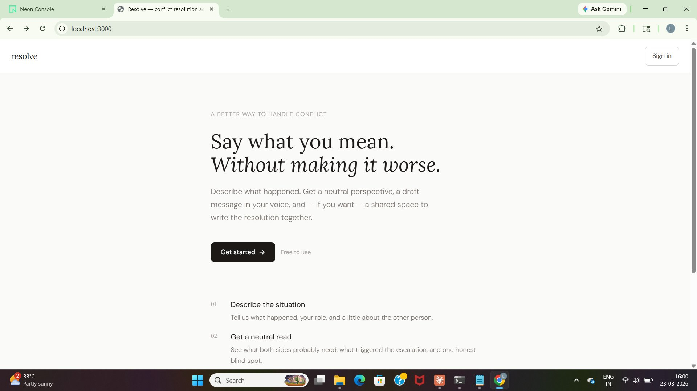
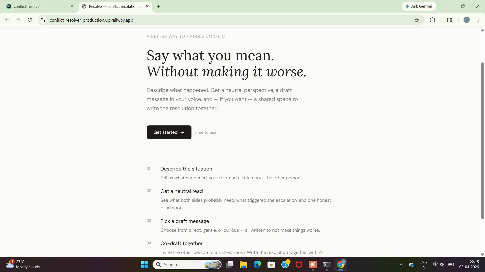
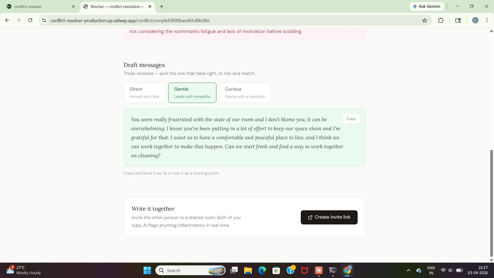
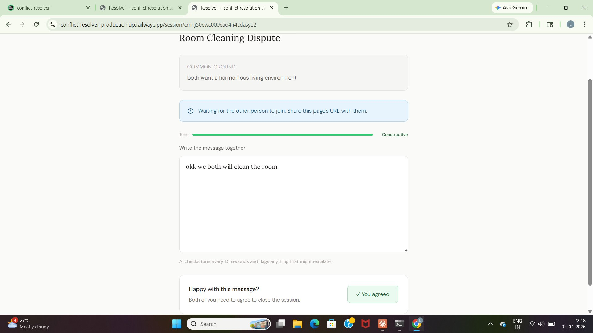

# Resolve — AI Conflict Resolution Assistant

> Say what you mean. Without making it worse.

A full-stack web application that helps people navigate difficult conversations. Describe what happened, get a neutral AI perspective, pick a draft message in your tone, and optionally co-draft a resolution with the other person in real time.

**Live demo:** https://conflict-resolver-production.up.railway.app

---

## Screenshots

### Landing page


### AI perspective analysis


### Draft message picker


### Live co-draft room


---

## Features

**Solo mode**
- Describe your conflict with as much or as little context as you want
- AI gives a neutral breakdown: what you probably need, what they probably feel, what triggered it, common ground, and your honest blind spot
- Choose from three message drafts — direct, gentle, or curious

**Co-draft room** (real-time)
- Generate a shareable invite link
- Both people join a live session
- Shared editor syncs in real time via WebSocket
- AI moderates tone every 1.5 seconds — flags accusatory phrases and suggests gentler alternatives
- Tone meter shows 1–10 constructive score as you type
- Both parties click "I'm satisfied" to close the session and save the final message

**Pattern analysis**
- After 2+ conflicts, get AI insight into your recurring triggers, patterns, and one honest thing to try

---

## Tech stack

| Layer | Technology |
|---|---|
| Frontend | Next.js 14, Tailwind CSS, React Hook Form |
| Auth | NextAuth.js with Google OAuth, Prisma adapter |
| Real-time | Socket.io (custom Node.js server) |
| AI | Groq API (Llama 3.3 70B) — free tier, 14,400 req/day |
| Database | PostgreSQL via Prisma ORM |
| Deployment | Railway (app + Postgres) |

---

## Architecture

```
┌─────────────────────────────────────────┐
│           Next.js App (Railway)          │
│                                         │
│  ┌─────────────┐    ┌────────────────┐  │
│  │  App Router  │    │  Socket.io     │  │
│  │  (REST API)  │    │  (WS rooms)    │  │
│  └──────┬──────┘    └───────┬────────┘  │
│         │                   │           │
│  ┌──────▼───────────────────▼────────┐  │
│  │          Groq API (LLM)           │  │
│  │  • analyzeConflict()              │  │
│  │  • generateDrafts()               │  │
│  │  • moderateDraft() [real-time]    │  │
│  │  • analyzePatterns()              │  │
│  └──────────────────────────────────┘  │
│                                         │
│  ┌──────────────────────────────────┐  │
│  │     PostgreSQL + Prisma ORM      │  │
│  │  Users, Conflicts, CoSessions    │  │
│  └──────────────────────────────────┘  │
└─────────────────────────────────────────┘
```

---

## AI prompting strategy

Three distinct prompts, each with a different job:

**Prompt 1 — Perspective analysis**
Neutral mediator framing. Explicitly instructed not to validate whoever is writing. Returns structured JSON: underlying need, other party's feelings, escalation trigger, common ground, blind spot.

**Prompt 2 — Draft messages**
Generates three tone variants (direct / gentle / curious) from the analysis. Hard rules: max 4 sentences, no accusatory framing, no therapy buzzwords, must sound like a real person.

**Prompt 3 — Live tone moderator**
Called every 1.5 seconds (debounced) on the co-draft editor. Returns a flag, the exact flagged phrase, a gentler suggestion, and a 1–10 tone score. Designed to only flag genuinely harmful patterns — not direct or assertive language.

---

## WebSocket co-draft flow

```
User A creates session → server creates room in memory
User B joins via invite link → both connected
                    ↓
Both type in shared editor → changes broadcast to other client
                    ↓
Debounced AI call every 1.5s → tone score + warning banner
                    ↓
Both click "I'm satisfied" → session_complete event
                    ↓
Final draft saved to DB → conflict marked RESOLVED
```

---

## Running locally

**Prerequisites:** Node.js 18+, PostgreSQL (or Neon free tier)

```bash
# Clone
git clone https://github.com/Lohith625/conflict-resolver.git
cd conflict-resolver

# Install
npm install

# Environment
cp .env.example .env.local
# Fill in: GROQ_API_KEY, NEXTAUTH_SECRET, NEXTAUTH_URL,
#          GOOGLE_CLIENT_ID, GOOGLE_CLIENT_SECRET, DATABASE_URL

# Database
npx prisma db push

# Start
npm run dev
```

Visit `http://localhost:3000`

---

## Environment variables

```env
# AI (free at console.groq.com)
GROQ_API_KEY=

# Auth
NEXTAUTH_SECRET=          # openssl rand -base64 32
NEXTAUTH_URL=             # http://localhost:3000

# Google OAuth (console.cloud.google.com)
GOOGLE_CLIENT_ID=
GOOGLE_CLIENT_SECRET=

# Database
DATABASE_URL=             # postgresql://...

# App
NEXT_PUBLIC_APP_URL=      # http://localhost:3000
NEXT_PUBLIC_WS_URL=       # http://localhost:3000
```

---

## Project structure

```
src/
├── app/
│   ├── conflict/new/        # Intake form
│   ├── conflict/[id]/       # Analysis + draft picker
│   ├── session/[id]/        # Live co-draft room
│   ├── dashboard/           # Conflict history + pattern analysis
│   └── api/
│       ├── analyze/         # POST → runs AI prompts 1 + 2
│       ├── moderate/        # POST → AI tone check (real-time)
│       ├── sessions/        # POST create, GET + PATCH by ID
│       └── patterns/        # POST → cross-conflict analysis
├── components/
│   ├── DraftPicker.tsx      # Tone variant selector
│   ├── DraftEditor.tsx      # Shared WebSocket editor
│   ├── ToneMeter.tsx        # 1–10 score bar
│   ├── ToneWarning.tsx      # Inline flag banner
│   ├── PresenceDots.tsx     # Who's in the room
│   └── PatternSection.tsx   # Pattern analysis sidebar
├── lib/
│   ├── claude.ts            # All 4 AI prompt functions (Groq)
│   ├── auth.ts              # NextAuth config
│   ├── prisma.ts            # DB client singleton
│   └── socket.ts            # Socket.io client singleton
└── server/
    └── server.js            # Custom Node server + Socket.io rooms
```

---

## What I'd add next

- Email notifications when someone joins your co-draft session
- Follow-up prompt 48 hours after a resolution ("did it work?")
- Tone history chart across conflicts over time
- Mobile app (React Native) — the core flow is very mobile-friendly

---

## Built by

**Lohith M** — BE Computer Science, BGSIT Mandya (Adichunchanagiri University)

- GitHub: [@Lohith625](https://github.com/Lohith625)
- Project: [conflict-resolver-production.up.railway.app](https://conflict-resolver-production.up.railway.app)
